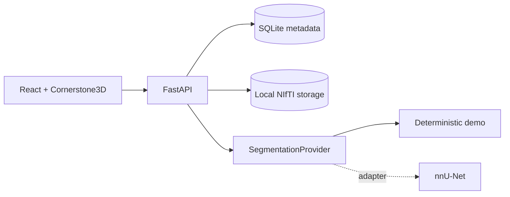

# NeuroAnnotate

**A local-first AI-assisted brain MRI annotation workspace for reviewing and correcting NIfTI lesion segmentations.**

> **Research and portfolio software.** NeuroAnnotate is not a medical device and must not be used for diagnosis or clinical decision-making.

## Demo

NeuroAnnotate turns a multimodal MRI case into an end-to-end annotation workflow:

```text
DWI + ADC + FLAIR
       ↓
three-plane MRI viewer
       ↓
deterministic AI pre-annotation
       ↓
brush / erase / undo / redo
       ↓
immutable revision history
       ↓
geometry-preserving NIfTI export
```

The repository ships with a **fully synthetic brain-MRI demo case**, so no patient data or external model weights are required.

## Features

- NIfTI-only `.nii` / `.nii.gz` workflow focused on DWI, ADC, and FLAIR.
- Browser-based axial, sagittal, and coronal viewing with Cornerstone3D.
- Pan, zoom, window/level, slice scrolling, modality switching, and segmentation overlay controls.
- CPU-only deterministic demo segmentation with no GPU or model download.
- Pluggable inference boundary ready for a future nnU-Net provider.
- Brush/erase editing with undo/redo.
- Immutable annotation revisions with optional notes.
- Exported masks preserve reference MRI geometry.
- FastAPI, SQLite metadata, local filesystem artifacts, Docker Compose, tests, and CI.

## Why this project

Medical-imaging ML demos often stop at notebooks or static predictions. NeuroAnnotate focuses on the software between model output and a usable human review workflow: data validation, browser visualization, inference orchestration, editing, provenance, and export.

That makes it a practical engineering companion to biomedical-ML work without claiming clinical readiness.

## Architecture



See [docs/architecture.md](docs/architecture.md) for the data and annotation round-trip details.

## Tech stack

**Frontend:** React 19, TypeScript, Vite, Zustand, Cornerstone3D 5  
**Backend:** Python 3.11+, FastAPI, SQLAlchemy 2, NumPy, SciPy, NiBabel  
**Persistence:** SQLite metadata + local NIfTI artifacts  
**Delivery:** Docker Compose + GitHub Actions

## Quick start

Requirements: Docker with Compose and `make`.

```bash
git clone https://github.com/sifat371/neuroannotate.git
cd neuroannotate
cp .env.example .env
make demo-data
make seed-demo
make dev
```

Open:

- App: `http://localhost:5173`
- API: `http://localhost:8000`
- OpenAPI: `http://localhost:8000/docs`

The first Docker build downloads normal project dependencies, but **does not download any model weights**.

## Demo workflow

1. Open **NeuroAnnotate Demo**.
2. Switch between DWI, ADC, and FLAIR.
3. Navigate axial/sagittal/coronal MRI views.
4. Run **AI Segmentation**.
5. Adjust overlay visibility/opacity.
6. Brush or erase part of the mask.
7. Undo/redo the change.
8. Save an immutable revision.
9. Reload a revision.
10. Export the corrected `.nii.gz` mask.

Detailed walkthrough: [docs/demo.md](docs/demo.md).

## API docs

When the backend is running, interactive OpenAPI documentation is available at `http://localhost:8000/docs`.

Core routes:

```text
GET  /api/cases
POST /api/cases
POST /api/cases/{id}/modalities/{DWI|ADC|FLAIR}
POST /api/cases/{id}/segment
GET  /api/cases/{id}/segmentations/latest/file
GET  /api/cases/{id}/revisions
POST /api/cases/{id}/revisions
GET  /api/cases/{id}/export?revision_id=<id>
```

## Project structure

```text
backend/      FastAPI, NIfTI validation, inference, revisions, export
frontend/     React/TypeScript + Cornerstone3D annotation workspace
data/         local runtime metadata/artifacts (ignored)
sample_data/  generated synthetic MRI demo volumes (ignored)
docs/         architecture and demo documentation
scripts/      end-to-end smoke verification
```

## Testing

With Docker:

```bash
make test
make lint
bash scripts/smoke.sh
```

Backend-only development without Docker:

```bash
cd backend
pip install ".[dev]"
pytest -v
ruff check app tests
```

Frontend-only development:

```bash
cd frontend
npm install
npm test -- --run
npm run lint
npm run build
```

## Limitations

- v1 supports NIfTI only; DICOM and PACS are intentionally out of scope.
- No authentication, collaboration, or cloud storage.
- Geometry mismatch is rejected rather than automatically registered/resampled.
- The built-in segmentation provider is a deterministic image-processing demo, **not a trained medical model**.
- nnU-Net is represented by an adapter boundary; weights and real inference are not bundled.
- No uncertainty, failure prediction, active learning, or LLM assistance in v1.

## Roadmap

- Real nnU-Net/other model adapter with explicit model packaging.
- Annotator productivity telemetry and correction analytics.
- Risk-aware review prioritization after real failure cases are collected.
- DICOM/PACS and collaboration only if the local NIfTI workflow proves useful.

## License

MIT — see [LICENSE](LICENSE).
