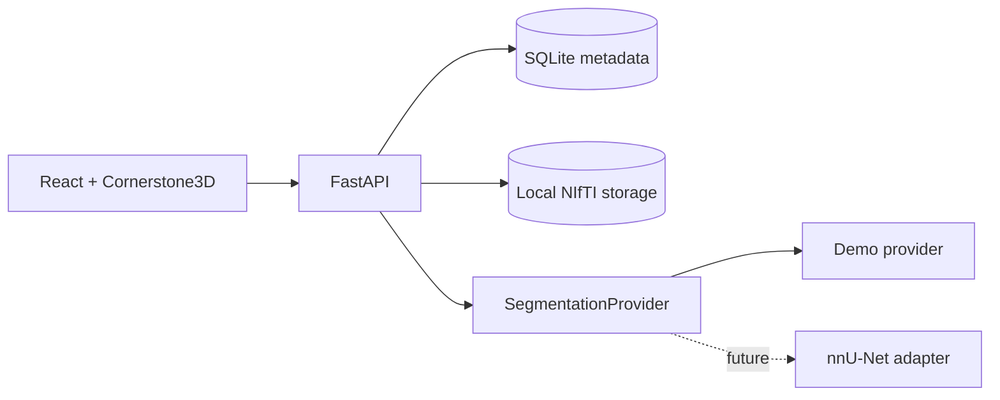

# NeuroAnnotate Architecture

NeuroAnnotate v1 is intentionally a thin local-first monorepo. The browser owns interaction and visualization; FastAPI owns persistence, NIfTI validation, segmentation execution, revision provenance, and export.

## Boundaries

- **Frontend:** React, TypeScript, Zustand, Cornerstone3D. It never writes NIfTI headers itself; edited labelmap bytes are submitted to the backend.
- **API:** FastAPI provides stable case, modality, segmentation, revision, and export endpoints.
- **Metadata:** SQLite stores case and provenance records only.
- **Artifacts:** DWI/ADC/FLAIR, inference masks, and immutable revision masks live under the configured data directory.
- **Inference:** `SegmentationProvider` separates the deterministic CPU demo from the future nnU-Net adapter.

## Annotation round trip

Cornerstone exposes its labelmap in x-fastest order. The frontend copies it into a `Uint8Array`, submits the bytes plus `[dimX, dimY, dimZ]`, and the backend reconstructs with NumPy `order="F"`. The reference DWI affine is retained for each saved revision.

## Privacy posture

v1 is local-first and includes no authentication, cloud upload, PACS integration, or clinical workflow claims. Users are responsible for the data they choose to load. The repository includes synthetic demo MRI only.
