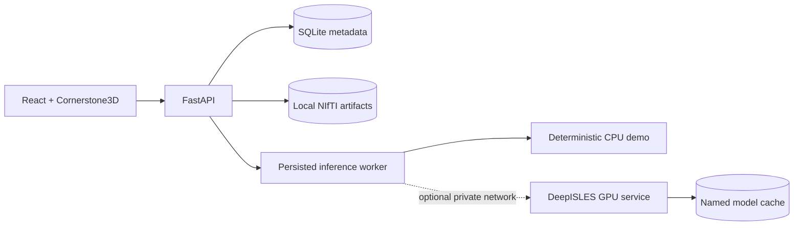

# NeuroAnnotate architecture

NeuroAnnotate v1 is a single-user, local/self-hosted research-software monorepo. The browser owns
interaction and visualization; FastAPI owns validation, persistence, job execution, immutable
revision history, provenance, and export. v1 is NIfTI-only and has no telemetry.

## Component boundaries

- **Frontend:** React, TypeScript, Zustand, and Cornerstone3D load the three source volumes and a
  DWI-native labelmap. The browser submits complete x-fastest labelmap bytes; it does not write
  the NIfTI header or affine.
- **API:** FastAPI exposes case, modality, inference-job, segmentation, revision, export, and
  health boundaries. Uploaded NIfTI is treated as untrusted and validated.
- **Metadata:** SQLite stores identifiers, source metadata/checksums, durable job states,
  revision lineage/edit summaries, and export records.
- **Artifacts:** Immutable sources, model masks, revisions, and export snapshots live beneath the
  configured local data directory. Publication uses staging/temporary paths and atomic moves.
- **Inference:** A provider interface separates the deterministic CPU demonstration from the v1
  optional DeepISLES service. The DeepISLES container is pinned, uses one GPU, has no host port,
  and persists weights in a named volume.

## Data and annotation round trip

Case import accepts exactly DWI, ADC, and FLAIR atomically. Each source records managed-byte
SHA-256 and NIfTI metadata. DWI establishes canonical annotation space.

The job queue snapshots immutable source IDs/checksums. Its local worker transitions jobs through
`queued`, `running`, and terminal `completed`/`failed` states, validates binary provider output,
and only then publishes a segmentation artifact.

Cornerstone exposes its labelmap in x-fastest order. The frontend copies it into a `Uint8Array`;
the backend reconstructs with NumPy `order="F"`, writes a binary `uint8` NIfTI using DWI geometry,
and saves a new immutable revision. Export rechecks the dependency graph and emits a fixed mask,
portable provenance, and a two-entry ZIP. See [workflow.md](workflow.md) and
[provenance.md](provenance.md).

## Trust and privacy boundaries

There is no application authentication, so the supplied deployment must remain behind a trusted
host/network boundary. The backend validates uploaded files and model output but does not claim
complete protection from malicious input. The GPU service is private in Compose by default.
Portable provenance rejects absolute paths and original filenames, although IDs and optional
notes can remain sensitive. See [SECURITY.md](../SECURITY.md).

NeuroAnnotate is not a medical device and is not for diagnosis, treatment, or clinical
decision-making.
